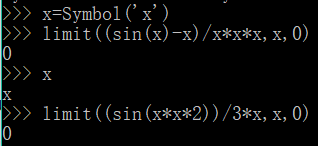
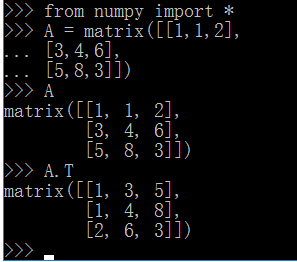

# 用 python 做计算器，做数学题

## Python

Python是一种广泛使用的高级编程语言，属于通用型编程语言，由吉多·范罗苏姆创造，第一版发布于1991年。可以视之为一种改良（加入一些其他编程语言的优点，如面向对象）的LISP。作为一种解释型语言，Python的设计哲学强调代码的可读性和简洁的语法（尤其是使用空格缩进划分代码块，而非使用大括号或者关键词）。相比于C++或Java，Python让开发者能够用更少的代码表达想法。不管是小型还是大型程序，该语言都试图让程序的结构清晰明了。

## 用python做高等数学题

求当x趋近于0时，sin(2x^2)/3x的极限。

## 用python做线性代数题

求矩阵 [1,1,2][3,4,6][5,8,3] 的转置矩阵。

